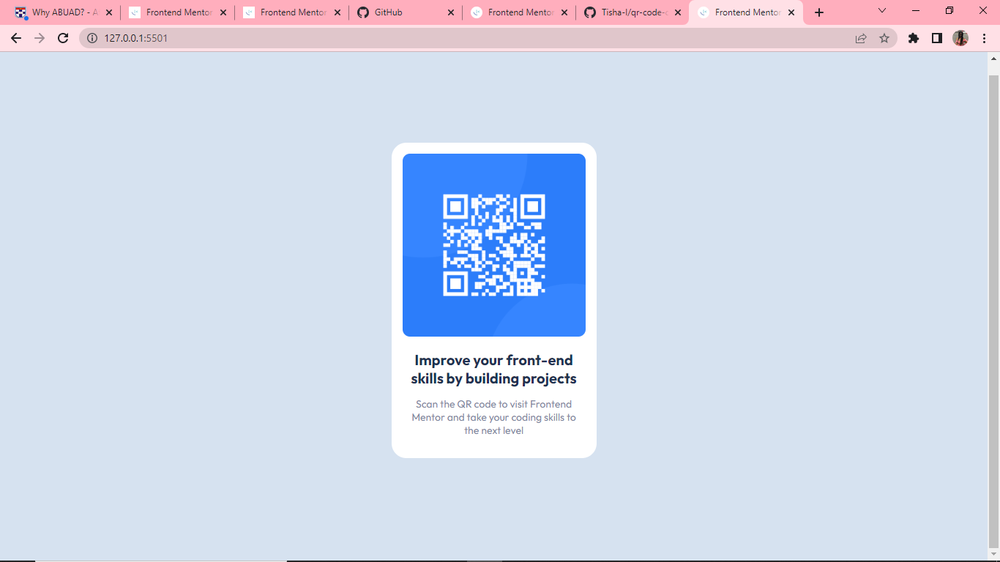

# Frontend Mentor - QR code component solution

This is a solution to the [QR code component challenge on Frontend Mentor](https://www.frontendmentor.io/challenges/qr-code-component-iux_sIO_H). Frontend Mentor challenges help you improve your coding skills by building realistic projects. 

## Table of contents

- [Overview](#overview)
  - [Screenshot](#screenshot)
  - [Links](#links)
  - [Built with](#built-with)
- [Author](#author)

## Overview

### Screenshot

### Links

- Solution URL: [Add solution URL here](https://github.com/Tisha-I/qr-code-component-main-by-TishaIgba.git)

### Built with

- HTML
- CSS
- Flex

## Author

- Name - [Igba Tisha Emuobosa]
- Frontend Mentor - [@Tisha-I](https://www.frontendmentor.io/profile/Tisha-I)
- Instagram - [@l.e.t.i.s.h.a](https://www.instagram.com/l.e.t.i.s.h.a)
